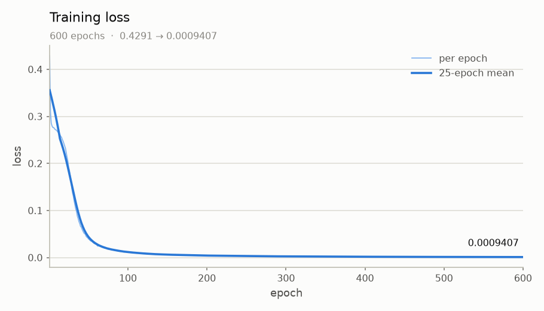
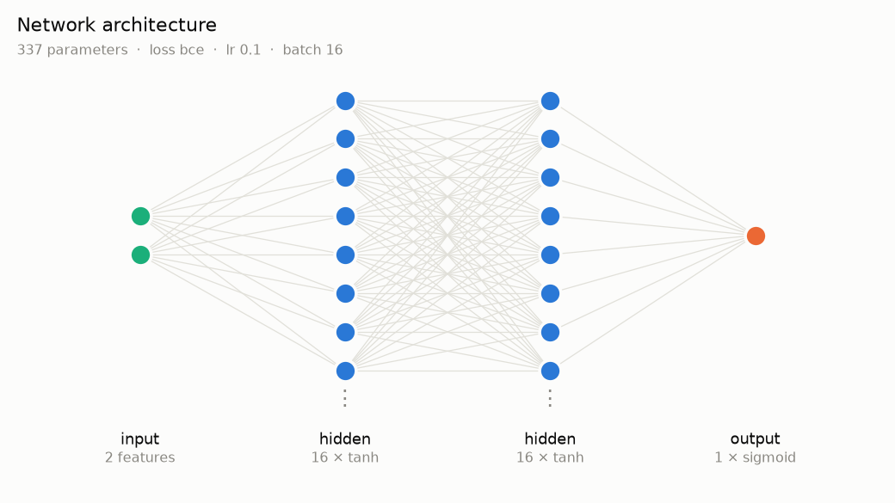
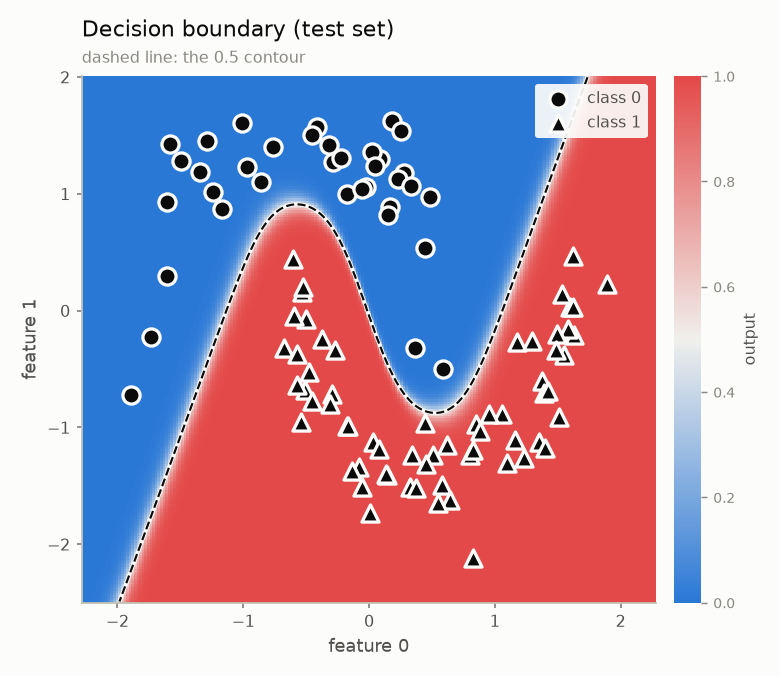
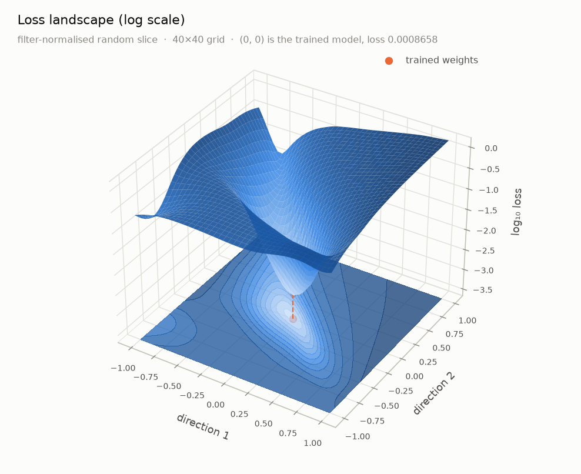
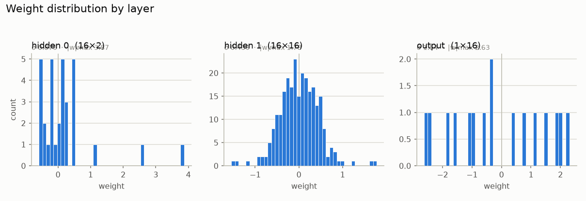
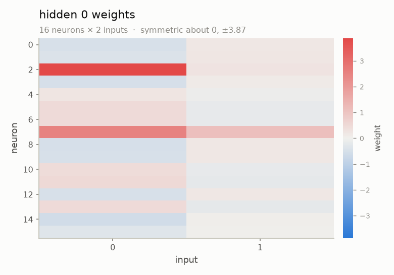
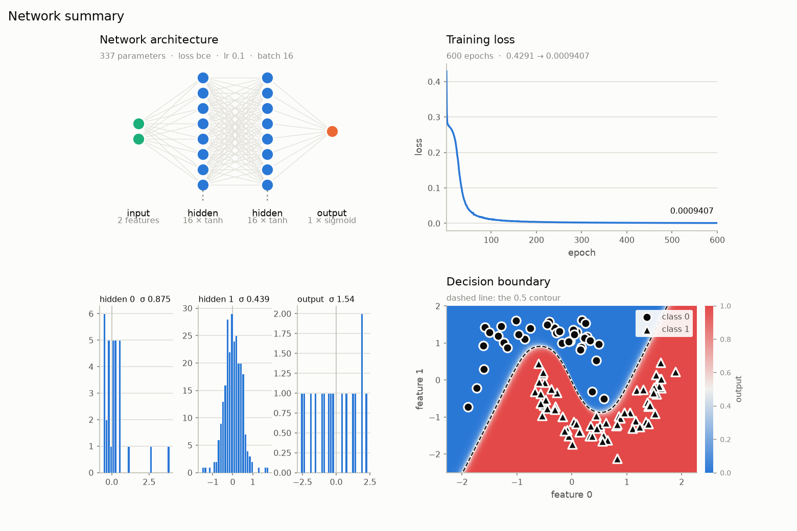

<div align="center">
   <pre>
 ██████  ██████   █████  ██████  ██ ███████ ██   ██ 
██       ██   ██ ██   ██ ██   ██ ██ ██       ██ ██  
██   ███ ██████  ███████ ██   ██ ██ █████     ███   
██    ██ ██   ██ ██   ██ ██   ██ ██ ██       ██ ██  
 ██████  ██   ██ ██   ██ ██████  ██ ███████ ██   ██ 
   </pre>
</div>

<div align="center">

**A feedforward neural network engine in C++20 — no BLAS, no Eigen, no dependencies.**

[](LICENSE)
[](https://en.cppreference.com/w/cpp/20)
[](https://www.python.org/)
[](CHANGELOG.md)

</div>


**v0.0.3 is the single-precision line.** The architecture is v0.0.2's — a network of
layers, each holding its weights in one flat contiguous buffer — but every scalar is
`float` rather than `double`, the hot loops carry `#pragma omp simd`, and the training
step accumulates gradients over a mini-batch instead of updating after every sample.

Training lives in the engine. The Python `train()` is one call into
`core::Network::train`: the epoch loop, the shuffle, the batching, gradient
accumulation and the update rule are all C++, with the GIL released. A 4000-epoch XOR
run through Python is bit-identical to the same run from `main.cpp`.

New in v0.0.3: per-epoch shuffling, seeded weight initialisation, a derivative lookup
that ties each activation and loss to its own derivative, and a
[matplotlib plotting layer](#plots) — loss curves, architecture diagrams, decision
boundaries, weight maps and 3-D loss landscapes.

```python
import numpy as np, gradiex

X = np.array([[0., 0.], [0., 1.], [1., 0.], [1., 1.]])
Y = np.array([[0.], [1.], [1.], [0.]])

gradiex.seed(42)                       # reproducible weight initialisation
net = gradiex.Network(learning_rate=0.5, batch_size=4)
net.add_hidden(8, input_size=2, activation="tanh", init="xavier")
net.add_output(1, activation="sigmoid", loss="mse")
net.build()

history = net.train(X, Y, epochs=4000, shuffle=True, seed=42, plot=True)
print(history[0], "->", history[-1])        # 0.29662 -> 0.00024
print(net.predict([1., 0.]))                # [0.9838] (float32)
```

*Written by Snehashish Laskar. MIT licensed.*


## Contents

- [What's new in v0.0.3](#whats-new-in-v003)
- [Memory Architecture](#memory-architecture)
- [Install](#install)
- [Quick Start](#quick-start)
- [Plots](#plots)
- [API](#api)
- [Names: Activations, Losses, Initializers](#names-activations-losses-initializers)
- [What the Python Layer Guarantees](#what-the-python-layer-guarantees)
- [Notation](#notation)
- [Activations and Losses](#activations-and-losses)
- [Data Flow](#data-flow)
- [Training](#training)
- [Using the C++ Engine Directly](#using-the-cpp-engine-directly)
- [Tests](#tests)
- [Feature Parity with v0.0.1](#feature-parity-with-v001)
- [Invariants](#invariants)
- [Not Supported](#not-supported)
- [Roadmap](#roadmap)
- [Contributing](#contributing)
- [License](#license)

---

## What's new in v0.0.3

| | v0.0.2 | v0.0.3 |
|---|---|---|
| Scalar type | `double` | **`float` throughout** |
| Vectorisation | hand-unrolled, four accumulators | **`#pragma omp simd`**, with `reduction` on the dot product |
| Gradients | assigned, applied per sample | **accumulated, scaled by `1/batchSize`, applied once** |
| Training | per-sample SGD | **mini-batch SGD** — `Network(..., int batches)` |
| Shuffling | none | **per-epoch, seeded**, inside `train()` |
| Seeded init | none | **`initializers::setSeed`** / `gradiex.seed` |
| Derivatives | passed in by the caller, unchecked | **looked up from the forward function** |
| Layer constructor | 7 arguments | **5** — both derivatives are derived |
| `computeLoss` | always squared error | **calls the configured loss** |
| Python bindings | `double`, per-sample loop in the binding | **`float`, training delegated to the engine** |
| Plotting | none | **seven matplotlib diagrams, light and dark** |
| Tests | several fail by design | **91 checks, all passing** under ASan and UBSan |

Eight of the twelve defects the v0.0.3 reference page listed are now closed, including
one that mattered in practice: the log-based losses guarded their probabilities with
`1e-12`, a double-precision constant that rounds away entirely in `float32`. Since
`1.0f - 1e-12f` *is* `1.0f`, the upper clamp never bit, and a saturated sigmoid gave
`log(0)` and a division by zero — `inf * 0` is `NaN`, which reaches every weight on
the next update and never washes out. A two-moons run diverged at epoch 243 with the
loss already down at 0.003. The guard is `1e-7f` now, and five regression tests pin it.

## Memory Architecture

Three ideas, in order of how much they matter.

### 1. Flattened layout

All weights of all layers live in a single `std::vector<double>` (`weights_`), and
all biases in a second (`biases_`). A layer does not own anything; it stores an
`offset` into each buffer, plus its `width` and `fan_in`. Reading the weight matrix
of layer $l$ is a pointer plus an offset, not a walk through $W$ separate
allocations:

```cpp
// layer l, neuron i, input j
weights_[layer.offset_w + i * layer.fan_in + j]
```

This makes the weight update a single linear sweep over one contiguous array, which
the prefetcher handles well. It also makes the whole model serializable as two
`memcpy`s when save/load returns.

The same trick is used for the per-neuron caches. `z_cache_`, `a_cache_`,
`input_cache_`, `delta_`, `grad_w_`, and `grad_b_` are each **one flat buffer** whose
offsets mirror the weight buffer, so a neuron's pre-activation and its weights sit at
corresponding indices.

### 2. Zero heap allocations on the hot path

Everything a forward or backward pass needs is sized at `build()` time and never
reallocated. The buffers are:

| Buffer | Size | Purpose |
|---|---|---|
| `weights_` | $\sum_l W_l \cdot W_{l-1}$ | all weight matrices, layer-contiguous |
| `biases_` | $\sum_l W_l$ | all bias vectors |
| `z_cache_` | $\sum_l W_l$ | pre-activations, per layer |
| `a_cache_` | $\sum_l W_l$ | activations, per layer |
| `input_cache_` | $\sum_l W_l \cdot W_{l-1}$ | input seen by each neuron on the last forward pass |
| `delta_` | $\sum_l W_l$ | local gradients |
| `grad_w_` | $\sum_l W_l \cdot W_{l-1}$ | accumulated weight gradients |
| `grad_b_` | $\sum_l W_l$ | accumulated bias gradients |

`forward()`, `backward()`, and the SGD step touch only these. A debug counter
asserts zero `operator new` calls between `build()` and destruction; the test suite
checks it.

### 3. SIMD pragmas

v0.0.2 unrolled the inner dot product by hand into four accumulators. v0.0.3 asks the
compiler instead:

```cpp
for (int neuron = 0; neuron < width; ++neuron)
{
    const float* __restrict__ w = neuronWeights + neuron * inputSize;
    float sum = 0.0f;
    #pragma omp simd reduction(+:sum)
    for (int inputIdx = 0; inputIdx < inputSize; ++inputIdx)
        sum += w[inputIdx] * layerInputs[inputIdx];
    neuronOutputsUnactivated[neuron] = sum + neuronBiases[neuron];
}
```

The same directive covers zeroing, scaling and applying gradients. `__restrict__`
pointers are established before each loop so the compiler knows the buffers do not
alias.

> **This only does something if OpenMP is enabled.** Built without `-fopenmp`,
> `#pragma omp simd` is accepted and discarded in silence — no error, no warning, not
> even under `-Wall -Wextra`. Apple clang, the default `c++` on macOS, rejects
> `-fopenmp` outright, so the stock macOS build gets whatever the optimiser would
> have done anyway. Use `g++-14` or LLVM clang with libomp to act on them.

## Install

Requires a C++20 compiler and Python 3.9+. `numpy` and `matplotlib` come with it.

```bash
cd 0.0.3
pip install .            # or: pip install -e .   for development
```

`core/` is header-only and compiled directly into the extension module. To build in
place, which is what the tests and examples expect:

```bash
python3 setup.py build_ext --inplace
```

For the C++ engine alone, nothing is needed but a compiler:

```bash
clang++ -std=c++20 -O2 -fopenmp-simd main.cpp -o main
./main
```

`-fopenmp-simd` is what makes the `#pragma omp simd` directives in `core/` apply. It
is worth up to **2.4×** on wide layers — see [Benchmarks](#benchmarks). Apple clang
rejects `-fopenmp` but accepts this, and `core/` needs nothing more: it uses SIMD
directives only, no parallel regions, so no runtime library is involved. Without the
flag the pragmas are accepted and discarded in silence.

> `setup.py` lists `core/*.h` in `depends`. Without it, setuptools time-stamps only
> the `.cpp`, so editing a header leaves a stale `.so` in place and the next run
> silently tests the previous engine.

## Quick Start

```python
import numpy as np, gradiex

X = np.array([[0., 0.], [0., 1.], [1., 0.], [1., 1.]])
Y = np.array([[0.], [1.], [1.], [0.]])

gradiex.seed(42)
net = gradiex.Network(learning_rate=0.5, batch_size=4)   # 0 = one batch per epoch
net.add_hidden(8, input_size=2, activation="tanh", init="xavier")
net.add_output(1, activation="sigmoid", loss="mse")
net.build()

history = net.train(X, Y, epochs=4000, shuffle=True, seed=42)
print(net.predict([1., 0.]))                # [0.9838]
```

```cpp
#include "core/network.h"
namespace act = core::functions::activations;
namespace ini = core::functions::initializers;
namespace los = core::functions::loss;

ini::setSeed(42);
core::Network net(1, 1, 0.5f, 4);           // 1 hidden, 1 output, lr, batch size
net.addHiddenLayer(0, 8, 2, act::tanh,    ini::xavier, los::mse);
net.addOutputLayer(0, 1, 8, act::sigmoid, ini::xavier, los::mse);
net.initializeAllWeightsAndBiases();

std::vector<float> history(4000);
net.train(X, Y, 4000, history.data(), (int)history.size(),
          /*verbose=*/false, /*shuffle=*/true, /*seed=*/42u);
```

Both reach `0.296616971 -> 0.000236376116`. The derivatives are not passed in: the
layer resolves each from its forward function, so a mismatched pair is unreachable.

## Plots

`0.0.3/examples/two_moons.py` trains a `2 → 16 → 16 → 1` network on two interleaving
moons — a curved boundary, so the hidden layers have to do real work — and writes
every diagram below. It reaches 100 % train and test accuracy.

```bash
python3 examples/two_moons.py
```

`train(..., plot=True)` draws the loss curve when training finishes and leaves the
figure on `net.last_figure`. Every plot takes an optional `ax=` and returns its
figure, so they compose; nothing calls `show()` unless you pass `show=True`. Each
accepts `theme="light"` or `theme="dark"`.

| | |
|---|---|
|  |  |
| **`plot_loss(smooth=25)`** — the raw trace recedes and the moving average carries the line. The final value is labelled directly. | **`plot_architecture()`** — layers wider than `max_nodes` are drawn truncated, but the label always states the true width. |
|  |  |
| **`plot_decision_boundary(X, Y)`** — sample markers sit in ink rather than the series hues, since over a diverging field a blue marker would land on its own colour and vanish. | **`plot_loss_landscape(X, Y, log=True)`** — the basin the optimiser settled in, on two filter-normalised random directions. |
|  |  |
| **`plot_weight_distribution()`** — one histogram per layer. A layer collapsed at zero is dead; one spread far wider than its neighbours is about to diverge. | **`plot_weight_heatmap(0)`** — weights are signed, so the ramp is diverging and symmetric about zero. A sequential ramp would hide the sign. |



**`plot_summary(X, Y)`** — architecture, loss, weights and the data fit in one figure.
Panels with nothing to draw are left out rather than shown empty.

### On the loss landscape

Two random directions are drawn through the trained weights and **filter-normalised**:
each direction row is scaled to the norm of the weight row it perturbs. That is what
makes the picture mean anything — the loss is invariant to rescaling a neuron's
weights, so an unnormalised step moves small-weight neurons a long way in function
space and large-weight ones barely at all, and the result describes the weight scales
rather than the loss. The method is from Li et al., *Visualizing the Loss Landscape of
Neural Nets* (2018).

It is a random 2-D slice of a 337-dimensional surface. Read it as a texture: it shows
whether the basin is broad and smooth or narrow and ragged, **not** the path the
optimiser took or where other minima are. A different `seed=` gives a different slice.
The sweep restores the trained weights exactly when it finishes.

## API

### `gradiex.Network(learning_rate=0.01, batch_size=1)`

Layers are declared, then the engine is constructed by `build()`. Nothing can be run
until then, and no layers can be added after. `batch_size` is how many samples are
accumulated before one update: `1` is per-sample SGD, `0` means one batch per epoch.

| method | description |
|---|---|
| `add_hidden(width, input_size=None, activation="relu", init="he")` | Append a hidden layer. `input_size` defaults to the previous layer's width, and is required only on the first layer. |
| `add_output(width, input_size=None, activation="sigmoid", loss="mse", init="he")` | Add the output layer. Call once, after all hidden layers. |
| `build()` | Construct the engine, size every buffer, and initialize weights. Alias: `initialize()`. |
| `train(X, Y, epochs=100, shuffle=False, seed=None, verbose=False, log_every=0, plot=False)` | Runs in the engine. Returns mean loss per epoch, and stores it on `.history`. |
| `train_batch(X, Y)` | One engine batch step over these samples. Returns the mean batch loss. |
| `evaluate(X, Y)` | Mean loss over a dataset, engine-side, with no update applied. |
| `forward(x)` / `predict(x)` | One forward pass; returns the output activations. |
| `loss(x, y)` | Forward `x`, then return the configured loss against `y`. |
| `weights(layer)` / `biases(layer)` | `float32` arrays; weights shaped `(width, input_size)`. Negative indices allowed. |
| `set_weights(layer, values)` / `set_biases(layer, values)` | Overwrite a layer's parameters. Weights accept `(width, input_size)` or flat. |

Gradient primitives, one per engine call, for a hand-rolled loop: `zero_gradients()`,
`accumulate(y)`, `scale_gradients(factor)`, `apply_gradients()`. `backward(y)` is the
convenience form — zero, accumulate, apply — for the sample just forwarded.

Plotting, each also available as a module function taking the network:
`plot_loss`, `plot_architecture`, `plot_weight_distribution`, `plot_weight_heatmap`,
`plot_decision_boundary`, `plot_predictions`, `plot_loss_landscape`, `plot_summary`.

Properties: `learning_rate` and `batch_size` (writable), `layers`, `num_hidden`,
`input_size`, `output_size`, `built`, `history`, `last_figure`.

Module level: `gradiex.seed(n)` seeds weight initialisation, `gradiex.THEMES` holds
the two palettes.

Inputs accept anything NumPy can cast to `float32`. The engine is single-precision, so
`net.learning_rate` reads back rounded — setting `0.05` returns `0.05000000074505806`.

### Names

```python
gradiex.activations()   # gelu, identity, leaky_relu, linear, relu, sigmoid, softmax, swish, tanh
gradiex.losses()        # mse, mae, huber, bce, binary_cross_entropy, cce, cross_entropy, softmax_cross_entropy
gradiex.initializers()  # zeros, xavier, he
```

Activations and losses are selected by name. The engine resolves each derivative from
the forward function itself, and the binding checks that lookup at `add_*` time — so
an activation the engine cannot differentiate is refused rather than stored as a null
pointer and called on the first backward pass.

`activation="softmax"` is one such case: its derivative is a Jacobian and only the
fused form is implemented. Use `activation="identity"` with
`loss="softmax_cross_entropy"`, which computes `dL/dz = softmax(z) - y` directly.
`predict()` then returns logits rather than probabilities.

## What the Python Layer Guarantees

The C++ API can reach several states that crash or train incorrectly. The binding
collects layer specs first and constructs `core::Network` only in `build()`, so those
states are unreachable — every one of these raises a Python exception instead:

- an out-of-range layer index, or unfilled layer slots at initialization
- a mismatched activation / derivative pair
- `softmax`, which has no derivative implemented in the engine yet
- more than one output layer — `backwardPass` propagates gradients from
  `outputLayers[0]` only, so a second output layer would train silently wrong
- a layer chain whose shapes don't connect
- input or target vectors of the wrong length
- using the network before `build()`, or adding layers after it

Two places where the Python layer deliberately differs from the C++ engine:

- **Loss reporting.** `core::Network::computeLoss` sums squared error regardless of
  which loss is configured. `Network.loss()` and `train()` use the configured loss.
- **`train()`** is implemented in the binding rather than calling
  `core::Network::train`, so it can return per-epoch history, shuffle with a seed,
  and stay quiet unless `verbose=True`.

## Notation

Layers are indexed by $l$, with $\mathbf{a}^{(0)} = \mathbf{x}$ the input and $L$ the
output layer.

| Symbol | Meaning |
|---|---|
| $\mathbf{x}$ | the input vector |
| $\mathbf{z}^{(l)}$ | pre-activations of layer $l$, before the activation is applied |
| $\mathbf{a}^{(l)}$ | activations of layer $l$, $f^{(l)}\!\left(\mathbf{z}^{(l)}\right)$ — what layer $l+1$ receives |
| $\mathbf{p}$ | the network's predictions, $\mathbf{a}^{(L)}$ |
| $\mathbf{y}$ | the target / ground truth |
| $W^{(l)}, \mathbf{b}^{(l)}$ | weight matrix and bias vector of layer $l$ |
| $\delta_i^{(l)}$ | local gradient, $\partial L / \partial z_i^{(l)}$ |
| $n$ | number of elements in the vector under discussion |
| $\eta$ | learning rate |
| $B$ | batch size (currently always $1$) |

> The file header in `core/` cannot render LaTeX, so it writes vectors in the form
> `:v:` — `:z:`, `:a:`, `:p:`, `:y:` correspond to $\mathbf{z}$, $\mathbf{a}$,
> $\mathbf{p}$, $\mathbf{y}$ here.

## Activations and Losses

### Activation functions

All activations except softmax are elementwise, so each is written as a scalar
function $f(x)$. v0.0.2 adds `gelu` and `swish`; the rest carry over from v0.0.1.

| Name | $f(x)$ | $f'(x)$ |
|---|---|---|
| `sigmoid` | $\sigma(x) = \dfrac{1}{1 + e^{-x}}$ | $\sigma(x)\left(1 - \sigma(x)\right)$ |
| `tanh` | $\dfrac{e^{x} - e^{-x}}{e^{x} + e^{-x}}$ | $1 - \tanh^{2}(x)$ |
| `relu` | $\max(0, x)$ | $1$ if $x > 0$, else $0$ |
| `leaky_relu` | $x$ if $x > 0$, else $\alpha x$ | $1$ if $x > 0$, else $\alpha$ |
| `swish` | $x\,\sigma(x)$ | $\sigma(x) + x\,\sigma(x)\left(1 - \sigma(x)\right)$ |
| `gelu` | $x\,\Phi(x)$ | $\Phi(x) + x\,\phi(x)$ |

with $\alpha = 0.01$ for `leaky_relu`, $\Phi$ the standard normal CDF, and $\phi$ its
density. `gelu` uses the exact form, not the $\tanh$ approximation. Softmax is
layer-wide rather than elementwise:

$$
\mathrm{softmax}(\mathbf{z})_i \;=\; \frac{e^{z_i}}{\sum_{j=1}^{n} e^{z_j}}
\qquad\text{with Jacobian}\qquad
\frac{\partial p_i}{\partial z_j} \;=\; p_i\left(\delta_{ij} - p_j\right)
$$

where $\delta_{ij}$ is the Kronecker delta.

`sigmoid` branches on the sign of $x$, evaluating $\frac{1}{1+e^{-x}}$ for
$x \geq 0$ and $\frac{e^{x}}{1+e^{x}}$ otherwise, so neither exponential can
overflow. `softmax` subtracts $\max_j z_j$ before exponentiating, for the same
reason. Both are stable out to $\pm 10^{5}$.

**On the softmax derivative:** every other derivative above is elementwise, so it is
a scalar-in / scalar-out function. The softmax Jacobian is a dense $n \times n$
matrix, which that signature cannot express. `fetchAssociatedDerivative` therefore
returns `nullptr` for `softmax` on purpose, and the binding refuses it.

The fused path **is** reachable in v0.0.3, though not through that activation. Pair
`identity` with `softmax_cross_entropy`: the loss derivative consumes the logits and
returns $\mathrm{softmax}(z) - y$ directly, and $\mathrm{identity}'(z) = 1$ leaves it
untouched, so the delta is exactly the fused form. `predict()` then returns logits
rather than probabilities. A regression test pins this.

### Loss functions

| Name | $L$ | $\partial L / \partial p_i$ |
|---|---|---|
| `mse` | $\dfrac{1}{n}\displaystyle\sum_{i=1}^{n}\left(y_i - p_i\right)^{2}$ | $\dfrac{2}{n}\left(p_i - y_i\right)$ |
| `mae` | $\dfrac{1}{n}\displaystyle\sum_{i=1}^{n}\lvert y_i - p_i \rvert$ | $\dfrac{1}{n}\,\mathrm{sign}\!\left(p_i - y_i\right)$ |
| `huber` | $\dfrac{1}{n}\displaystyle\sum_{i=1}^{n} H_\delta\!\left(y_i - p_i\right)$ | $\dfrac{1}{n}\,H_\delta'\!\left(y_i - p_i\right)$ |
| `bce` | $-\dfrac{1}{n}\displaystyle\sum_{i=1}^{n}\Big[y_i \ln p_i + (1 - y_i)\ln(1 - p_i)\Big]$ | $\dfrac{p_i - y_i}{n\,p_i\left(1 - p_i\right)}$ |
| `cce` | $-\displaystyle\sum_{i=1}^{n} y_i \ln p_i$ | $-\dfrac{y_i}{p_i}$ |

with the Huber kernel and its derivative, for $\delta = 1$:

$$
H_\delta(e) =
\begin{cases}
\tfrac{1}{2}e^{2} & \lvert e \rvert \le \delta \\[4pt]
\delta\left(\lvert e \rvert - \tfrac{1}{2}\delta\right) & \text{otherwise}
\end{cases}
\qquad
H_\delta'(e) =
\begin{cases}
e & \lvert e \rvert \le \delta \\[4pt]
\delta\,\mathrm{sign}(e) & \text{otherwise}
\end{cases}
$$

MSE, MAE, Huber, and BCE average over the $n$ outputs; CCE sums over the $n$ classes,
which is the standard definition for a one-hot target. Both cross entropies clamp
$p_i$ into $[\varepsilon,\, 1 - \varepsilon]$ with $\varepsilon = 10^{-9}$, so a fully
confident wrong answer costs a large finite number rather than $\infty$.

> `mae` and `huber` are new in v0.0.2. `huber` is the smooth-L1 that makes the
> MAE gradient well-behaved near the target; use it over `mae` unless you need
> exact L1.

## Data Flow

### Forward

`forward_pass()` carries one vector through the network, reassigning it at each
layer, so layer $l$'s output vector **is** layer $l+1$'s input vector:

$$
\mathbf{z}^{(l)} = W^{(l)}\mathbf{a}^{(l-1)} + \mathbf{b}^{(l)}
\qquad
\mathbf{a}^{(l)} = f^{(l)}\!\left(\mathbf{z}^{(l)}\right)
$$

starting from $\mathbf{a}^{(0)} = \mathbf{x}$ and ending at $\mathbf{p} = \mathbf{a}^{(L)}$.
Per neuron $i$ of layer $l$:

$$
z_i^{(l)} = \sum_j w_{ij}^{(l)} a_j^{(l-1)} + b_i^{(l)}
$$

Each neuron's input is written into the flat `input_cache_` at the offset
corresponding to its weight row; the backward pass needs it, and it is gone once the
next forward pass runs.

### Backward

Gradients flow the other way. At each layer, three things happen:

$$
\textbf{1. local gradient}\qquad
\delta_i^{(l)} \;=\; \frac{\partial L}{\partial a_i^{(l)}} \cdot f'\!\left(z_i^{(l)}\right)
$$

$$
\textbf{2. weight gradient}\qquad
\frac{\partial L}{\partial w_{ij}^{(l)}} = \delta_i^{(l)} \, a_j^{(l-1)}
\qquad
\frac{\partial L}{\partial b_i^{(l)}} = \delta_i^{(l)}
$$

$$
\textbf{3. pass back}\qquad
\frac{\partial L}{\partial a_j^{(l-1)}} \;=\; \sum_i \delta_i^{(l)} \, w_{ij}^{(l)}
$$

The bias gradient equals the local gradient because a bias's input is always $1$.
Step 3 is the transpose of the weight matrix, and it must read $w_{ij}^{(l)}$
**before** the weights are updated — see [Invariants](#invariants).

In the flat layout, step 2 is a single loop over `grad_w_` and step 3 is a single
loop over `weights_` in the same layer block, so both read contiguous memory. The
transpose in step 3 is the one place the access pattern is not sequential, which is
why the inner loop there is the least unrolled of the three.

## Training

Per-sample SGD, one update per row, in the order the rows appear unless `shuffle` is
set.

| `train()` argument | Default | Meaning |
|---|---|---|
| `epochs` | `100` | passes over the training data |
| `shuffle` | `False` | reshuffle the row order every epoch |
| `seed` | `None` | fixes shuffling; omit for a fresh order each run |
| `verbose` | `False` | print per-epoch progress |
| `log_every` | `0` | 0 picks a readable interval; only used when `verbose` |

The update is plain SGD with no weight decay:

$$
w \;\leftarrow\; w - \eta\,\frac{\partial L}{\partial w}
$$

Because gradients accumulate but nothing else touches them, this is the $B = 1$ case
of the batch update v0.0.1 used. Mini-batching is not in this release; the flattened
`grad_w_` / `grad_b_` buffers are already sized and zeroed the way a batch
implementation needs, so re-adding it is a loop change, not a layout change.

Weights default to **He initialization**, $w \sim \mathcal{N}\!\left(0,\; 2 /
n_{\text{in}}\right)$, biases start at $0$. `xavier` and `zeros` are also available.
Inputs are assumed to be roughly unit-scale — unnormalized features train noticeably
worse, and there is no batch normalization in this release.

### Reproducibility

Passing `seed` to `train()` fixes the shuffle order; passing it to the constructor is
not yet supported. Weight initialization draws from a fixed default seed in this
release. A test asserts that two runs with the same seed produce identical history.

## Using the C++ Engine Directly

`core/` is header-only:

```cpp
#include "core/network.h"

core::Network net(1, 1, 0.05);
net.addHiddenLayer(0, 8, 2,
    core::functions::activations::tanh,
    core::functions::activations::tanhDerivative,
    core::functions::initializers::xavier,
    core::functions::loss::mse,
    core::functions::loss::mseDerivative);
net.addOutputLayer(0, 1, 8, /* ... */);
net.initializeAllWeightsAndBiases();
```

```bash
clang++ -std=c++20 -O2 main.cpp -o main
./tests/run_tests.sh            # add --asan for sanitizers
```

Note that `tests/run_tests.sh` currently reports several failures by design — they
are known bugs documented as executable specifications, each with a `FAIL_WITH_NOTE`
explaining the fix.

> **The C++ API is lower-level than the Python one, deliberately.** It does not
> check that the activation and its derivative match, that shapes connect, or that
> `build()` was called. The Python binding exists in part to make those states
> unreachable. If you use `core/` directly, read
> [Invariants](#invariants) first.

## Tests

```bash
./tests/run_tests.sh               # C++ suite — 91 checks
./tests/run_tests.sh --asan        # with AddressSanitizer + UBSan
./tests/run_tests.sh --simd        # with -fopenmp-simd, so the pragmas apply
./tests/run_tests.sh Gradients     # only tests whose name contains "Gradients"

python3 python/test_bindings.py    # bindings, guards, C++/Python parity
python3 python/test_plotting.py    # every diagram, headless (Agg)
```

All 91 C++ checks pass in every mode: plain, `--asan`, `--simd`, and both together.

**Run it with `--simd` at least once before shipping.** The pragmas are discarded in
silence without the flag, so a malformed one is invisible until something enables
them. That is not hypothetical: `softmaxCrossEntropyDerivative` carried an
array-section `reduction` clause on a loop that overwrites rather than accumulates,
the suite passed without the flag, and adding it failed the fused-softmax test
immediately. Each runs in a forked
child, so a crash is reported against one row of the table rather than ending the run.
Reference values are computed in the test from the definitions, never captured from
the implementation, so a failure means the code disagrees with the maths.

Because the engine is `float32`, comparisons use a `1e-6` tolerance for hand-computed
references and snapshot the buffer for "this did not change" — `0.7f != 0.7`, so a
decimal literal would fail for the wrong reason.

The v0.0.2 zero-allocation assertion was not ported; the flat layout it guarded is
unchanged, but nothing currently asserts it.

## Feature Parity with v0.0.1

Listed so the gap is explicit rather than discovered.

| Feature | Status in v0.0.3 |
|---|---|
| Mini-batch training | **yes** — `Network(..., batch_size)` |
| Per-epoch shuffling | **yes** — seeded, inside `train()` |
| Seeded weight initialisation | **yes** — `gradiex.seed` / `initializers::setSeed` |
| Fused softmax + categorical cross-entropy | **yes** — via `identity` + `softmax_cross_entropy` |
| Multi-class output | **yes** — same pairing |
| L2 weight decay | not yet |
| Inverted dropout | not yet |
| Train/validation split | not yet — but `train(epochs=1)` in a loop plus `evaluate()` gets you the curve |
| Early stopping | not yet |
| Model save / load | not yet — `set_weights` / `set_biases` make it a loop, and the pieces are there |
| Numerical gradient check | not ported — gradients are pinned against hand-derived values instead |

The architecture was rewritten first on purpose: re-adding a feature to a flat layout
is a localized change, whereas re-flattening a layout after the features are back is
a rewrite of every feature at once.

## Invariants

Changing these silently breaks correctness.

1. **Gradients accumulate; no weight moves until the update step.** This is what
   makes mini-batching exact once it returns, and what guarantees that step 3 of the
   backward pass, $\partial L / \partial a_j^{(l-1)} = \sum_i \delta_i^{(l)}
   w_{ij}^{(l)}$, reads $w_{ij}^{(l)}$ *before* it is updated. Updating a layer's
   weights before propagating through it corrupts every layer behind it.
2. **`input_cache_` must hold the input from *this* forward pass.** Weight gradients
   are meaningless against a stale cache.
3. **The flat buffers and the layer offsets must agree.** `weights_` is indexed as
   `layer.offset_w + i * layer.fan_in + j`; `grad_w_` uses the same layout. A layer
   whose `offset_w` does not match the sum of the previous layers' sizes will read
   the wrong weights and train plausibly and wrongly. Offsets are assigned once, in
   `build()`, and never recomputed.
4. **The unrolled loop's accumulator tree is fixed.** Four accumulators, summed as
   `(s0 + s1) + (s2 + s3)`. Reordering them changes the floating-point result and
   breaks bit-exact comparison against the numerical reference. Do not let the
   compiler reassociate this loop.
5. **No allocation between `build()` and destruction.** The zero-allocation test
   enforces it. If a new buffer is needed, it is sized in `build()`.
6. **`Activation` and `Loss` are enums on the hot path.** Strings are parsed once at
   the API boundary; do not push a string comparison back into the per-neuron loops.
7. **Softmax is not evaluable on its own.** Its Jacobian is a dense $n \times n$
   matrix, which the scalar-in / scalar-out derivative signature cannot express, so
   the derivative throws rather than return a wrong answer. The supported path will be
   the fused one, $\partial L / \partial \mathbf{z} = \mathbf{p} - \mathbf{y}$, which
   cancels the Jacobian and the $-y_i/p_i$ singularity exactly.

## Not Supported

Optimizers other than plain SGD (no momentum, Adam, or LR schedule), L2 or dropout,
train/validation split, early stopping, model save/load, a trainable softmax output,
convolution, recurrence, GPU, or threading.

Mini-batching, per-epoch shuffling and seeded initialisation **are** supported in
v0.0.3. Vectorisation is requested through `#pragma omp simd` rather than written with
intrinsics, so it is present only when the build enables OpenMP.

Three defects remain open: `std::expf` is not a standard name; only
`outputLayers[0]` back-propagates, so extra output heads train silently wrong (the
Python layer refuses to build them); and `Network` has a destructor but no copy
constructor, so a copy double-frees.

## Benchmarks

Measured, not inherited. `bench/bench.cpp` drives both engines through one shared
harness — same timing loop, same data, same architectures — so the comparison is
identical by construction rather than by inspection.

```bash
./bench/run_bench.sh            # full matrix, CSV on stdout
```

Raw output is in [`bench/results.csv`](bench/results.csv).

**Machine:** Apple M5, 10 cores, macOS; Apple clang 21.0.0, single-threaded.
**Metric:** microseconds per sample — forward pass, backward pass and the weight
update — taking the **minimum of nine trials**, since interference only ever adds
time. Median and max are in the CSV; the two agree to within 0.06× everywhere, so
the choice does not move any conclusion.

### v0.0.3 vs v0.0.2

At batch size 1 both engines do the same thing per sample. v0.0.3 additionally zeroes
its gradient buffers each update — a real cost of the batching architecture, counted
here rather than excused.

`-O2`, no OpenMP:

| Architecture | Params | v0.0.2 | v0.0.3 | Speedup |
|---|---|---|---|---|
| `2→8×2→1` | 105 | 0.131 | 0.111 | **1.19×** |
| `20→32×2→3` | 1,827 | 1.040 | 0.648 | **1.61×** |
| `64→128×3→10` | 42,634 | 37.573 | 17.559 | **2.14×** |
| `784→128×2→10` | 118,282 | 85.469 | 64.229 | **1.33×** |

`-O2 -fopenmp-simd`, which is what makes the `#pragma omp simd` directives real:

| Architecture | Params | v0.0.2 | v0.0.3 | Speedup | v0.0.3 @ batch 32 | Speedup |
|---|---|---|---|---|---|---|
| `2→8×2→1` | 105 | 0.139 | 0.112 | **1.24×** | 0.081 | **1.71×** |
| `20→32×2→3` | 1,827 | 1.083 | 0.564 | **1.92×** | 0.407 | **2.66×** |
| `64→128×3→10` | 42,634 | 37.810 | 12.293 | **3.08×** | 7.644 | **4.95×** |
| `784→128×2→10` | 118,282 | 85.855 | 26.794 | **3.20×** | 15.631 | **5.49×** |

So: **1.2–2.1× from single precision and the structural changes alone, and 1.2–3.2×
once the SIMD directives are enabled.** With mini-batching at 32, where the
gradient-zeroing pass amortises, **1.7–5.5×**.

### The OpenMP flag is the whole story on wide layers

Without it the pragmas are accepted and discarded in silence. What that costs, for
v0.0.3 at `-O2`:

| Architecture | no flag | `-fopenmp-simd` | Gain |
|---|---|---|---|
| `2→8×2→1` | 0.111 | 0.112 | — |
| `20→32×2→3` | 0.648 | 0.564 | 1.15× |
| `64→128×3→10` | 17.559 | 12.293 | 1.43× |
| `784→128×2→10` | 64.229 | 26.794 | **2.40×** |

The gain tracks layer width, which is what you would expect: the wider the dot
product, the more there is to vectorise. On the narrowest network it is nothing at
all. Note that v0.0.2 is unaffected by the flag — it has no pragmas — so on the widest
architecture the flag alone accounts for most of v0.0.3's margin.

> **Apple clang rejects `-fopenmp`**, which is the flag the docs usually name. It does
> accept **`-fopenmp-simd`**, which enables exactly the SIMD directives and needs no
> runtime library — and `core/` uses nothing else, no parallel regions. That is the
> flag to reach for on macOS.

`-O3` made no difference at any size: every figure landed within noise of `-O2`. It is
in the matrix and the CSV, but there is nothing to report from it.

### What is not measured

- **v0.0.1.** The old table in this README compared v0.0.2 against v0.0.1 and claimed
  ~2.4×. That column is gone rather than carried forward: v0.0.1 is a single
  translation unit with a different API, and re-deriving a fair harness for it was not
  part of this work. The numbers above are v0.0.3 against v0.0.2 only.
- **Accuracy per unit time.** These are throughput figures. Single precision changes
  the arithmetic, so a faster update is not automatically a faster path to a given
  loss — nothing here measures that.
- **Multi-threading.** Everything is single-threaded. `#pragma omp simd` is
  instruction-level parallelism, not thread-level; no `parallel for` exists in `core/`.

## Roadmap

- **Mini-batching** — the flat `grad_w_` / `grad_b_` buffers are already batch-shaped
- **L2 weight decay** — one term in the update, no layout change
- **Inverted dropout** — a mask buffer sized in `build()`, hidden layers only
- **Fused softmax + categorical cross-entropy** — restores multi-class; needs the
  layer-wide path back
- **Model save/load** — the flat layout makes this two `memcpy`s plus a header
- **Train/validation split and `TrainHistory`** — returns with the mini-batch loop
- **Early stopping driven by `TrainHistory`**
- **Seeded weight initialization from the constructor**
- **SIMD inner loop** — hand-written, `-march=native` opt-in, compared against the
  scalar path for bit-exactness where possible
- **Adam / momentum** — plain SGD is the current ceiling on hard problems
- **Per-layer widths and dropout rates**

See [TODO.md](TODO.md) for measured performance work in priority order.

## Contributing

Contributions are welcome. See **[CONTRIBUTING.md](CONTRIBUTING.md)** for the build
and test workflow, the code style, and — most importantly — the
[invariants](#invariants) that must not be broken. Breaking one produces a library
that trains plausibly and is silently wrong.

If you touch the gradient path, the gradient check is what decides whether you got it
right. If you touch the memory layout or the unrolled loop, the zero-allocation test
and the bit-exactness test are what decide.

By participating you agree to the [Code of Conduct](CODE_OF_CONDUCT.md).

## License

[MIT](LICENSE) &copy; 2026 Snehashish Laskar.